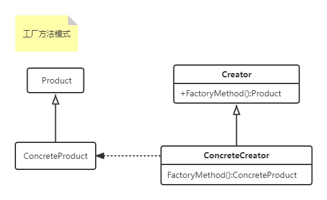

#### 工厂方法设计模式(`Factory Method`)

【学习难度：★★☆☆☆，使用频率：★★★★★】

> 定义一个用于创建对象的接口，让子类决定实例化哪一个类，使一个类的实例化延迟到其子类。
>
> 使用场景：
>
> - 当一个类不知道它所必须要创建对象的类的时候
> - 当一个类希望由它的子类来指定它所创建的对象的时候
> - 主要用于工具包和框架中
>
> 缺点：
> - 它们可能仅为了创建适当的Product对象而迫使你创建Creator子类，解决方案是在Creator类中提供一个模板子类，它使用Product类作为模板参数
>
> 相关模式:
>
> - 抽象工厂模式(Abstract Factory)常用工厂方法实现
> - 工厂方法通常在模板模式(Template Methods)被调用
> - 原型模式(ProtoTypes)不需要创建Creator的子类，但是他会要一个针对Product类的Initialize的操作，Creator使用Initialize来初始化对象
>
> 实现：
>
> - 提供Creator的一个模板子类，以避免重复创建Creator子类，使用泛型类

1. UML类图如下：

  

2. 上代码
```c#
using System;

namespace DesignerPattern
{
    public class FactoryMethodPattern
    {
        public static void TestFactoryMethodPattern_LoadMovies()
        {
            PlayerCreator carton = new StandardCreator<MovieCarton>();
            PlayerCreator marvel = new StandardCreator<MovieMarvel>();
            carton.LoadMovie().ShowMovie();
            marvel.LoadMovie().ShowMovie();
        }
    }

    public abstract class MovieProduct
    {
        public abstract void ShowMovie();
    }

    public abstract class PlayerCreator
    {
        public abstract MovieProduct LoadMovie();
    }

    /// <summary>
    /// 使用泛型定义模板创建工厂
    /// </summary>
    /// <typeparam name="T"></typeparam>
    public class StandardCreator<T> : PlayerCreator where T : MovieProduct,new()
    {
        public override MovieProduct LoadMovie()
        {
            return new T();
        }
    }

    public class MovieCarton : MovieProduct
    {
        public override void ShowMovie()
        {
            Console.WriteLine("I am showing Carton Movie!");
        }
    }

    public class MovieMarvel : MovieProduct
    {
        public override void ShowMovie()
        {
            Console.WriteLine("I am showing Marvel Movie!");
        }
    }

    public class MovieAdult : MovieProduct
    {
        public override void ShowMovie()
        {
            Console.WriteLine("I am showing Adult Movie!");
        }
    }
}

```