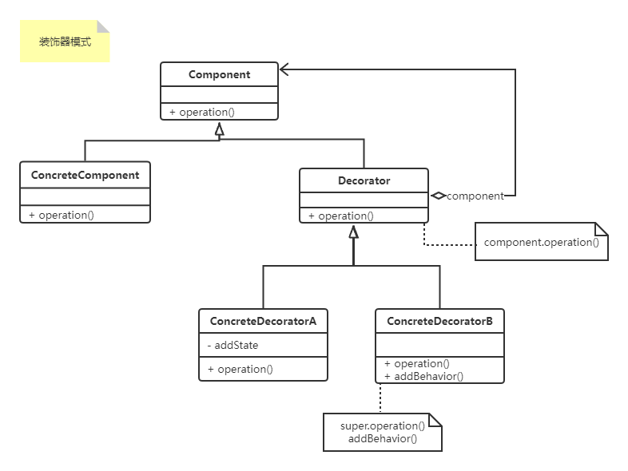

#### 装饰设计模式（`Decorator`）

【学习难度：★★★☆☆，使用频率：★★★☆☆】

> <font color=#FF6800>需要增加不同的行为且符合“开闭原则”，透明模式是指新增的行为会在装饰器的方法中调用，半透明模式则反。</font>
>
> Decorator 能做什么：
>
> 

1. 上ULM图：



2. 上代码：
下面的实现方式称为透明式，如果要实现安全式的组合模式只需要把其他管理子对象的方法声明在复合组合的对象中即可

```c#
using System;
using System.Collections.Generic;

namespace DesignerPattern
{
    public class CompositePattern
    {
        public static void TestCompositePattern()
        {
            Component cp1 = new Leaf();
            Component cp2 = new Composite();

            cp2.Add(cp1);

            cp1.Operation();
            cp2.Operation();
        }
    }

    public abstract class Component
    {
        protected List<Component> _components = new List<Component>();
        public abstract void Operation();
        public virtual void Add(Component component)
        {
            _components.Add(component);
        }
        public virtual void Remove(Component component)
        {
            _components.Remove(component);
        }
        public virtual IList<Component> GetChildren()
        {
            return _components;
        }
    }

    public class Leaf : Component
    {
        public override void Operation()
        {
            Console.WriteLine("Leaf Operate");
        }

        public override void Add(Component component)
        {
            throw new InvalidOperationException();
        }

        public override void Remove(Component component)
        {
            throw new InvalidOperationException();
        }

        public override IList<Component> GetChildren()
        {
            throw new InvalidOperationException();
        }
    }

    public class Composite : Component
    {
        public override void Operation()
        {
            foreach(var item in _components)
            {
                item.Operation();
            }
        }
    }
}

```

