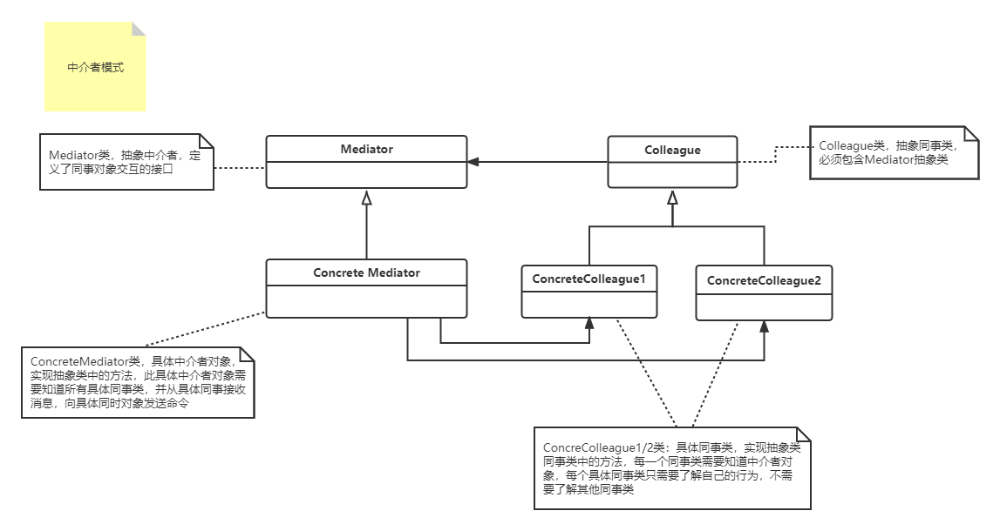

#### 中介者设计模式（Mediator）

>  <font color=#FF6800>中介者模式，定义了一个中介对象来封装一系列对象之间的交互，中介者使得各个对象之间相互独立，降低耦合性，而且能靠中介对象来改变他们之间的交互行为。</font>
>
>  使用场景：
>
>  - 一组对象以定义良好但是复杂的方式进行通信
>
>  - 一个对象引用其他对象并且直接与这些对象通信
>
>  - 想定制一个分布在多个类中的行为，而又不想生成太多的子类
>
>  缺点：
>
>  -  中介者模式将交互的复杂性变为中介者的复杂性，这可能使得中介者自身成为一个难以维护的庞然大物
>  -  需要新增同事类时，不得不修改中介者抽象类和具体类，可以用观察者模式和状态模式来解决

1. UML类图如下
  
  
2. 上代码
```c#
using System;

namespace DesignerPattern
{
    public class MediatorPattern
    {
        public static void TestMedistor_FightLandlord()
        {
            FightLandlord farmA = new FightSide(false);
            FightLandlord farmB = new FightSide(false);
            FightLandlord lanlord = new FightSide(true);

            Mediator mediator = new MediatorAccomplish(farmA, farmB, lanlord);
            farmA.ChangeMoney(100, mediator);

            Console.WriteLine($"农民赢:100￥");
            Console.WriteLine($"农民A:{farmA.Money}￥");
            Console.WriteLine($"农民B:{farmB.Money}￥");
            Console.WriteLine($"地主C:{lanlord.Money}￥");

            lanlord.ChangeMoney(50,mediator);
            Console.WriteLine($"地主赢:50￥");
            Console.WriteLine($"农民A:{farmA.Money}￥");
            Console.WriteLine($"农民B:{farmB.Money}￥");
            Console.WriteLine($"地主C:{lanlord.Money}￥");

            farmA.IsLandlord = true;
            farmB.IsLandlord = false;
            lanlord.IsLandlord = false;
            farmB.ChangeMoney(200, mediator);
            Console.WriteLine($"农民赢:200￥");
            Console.WriteLine($"地主A:{farmA.Money}￥");
            Console.WriteLine($"农民B:{farmB.Money}￥");
            Console.WriteLine($"农民C:{lanlord.Money}￥");
        }
    }

    /// <summary>
    /// 抽象牌友类
    /// </summary>
    public abstract class FightLandlord
    {
        public decimal Money { get; set; }
        public bool IsLandlord { get; set; }
        public FightLandlord(bool isLandlord)
        {

            Money = 0;
            IsLandlord = isLandlord;
        }
        public abstract void ChangeMoney(decimal money,Mediator mediator);
    }

    /// <summary>
    /// 牌友类，斗地主自己分配角色（农民、地主）
    /// </summary>
    public class FightSide : FightLandlord
    {
        public FightSide(bool isLandlord) : base(isLandlord)
        {
            base.Money = 1000;
            base.IsLandlord = IsLandlord;
        }
        public override void ChangeMoney(decimal money, Mediator mediator)
        {
            if (!IsLandlord)
                mediator.FarmWin(money);
            else
                mediator.LandlordWin(money);
        }
    }

    /// <summary>
    /// 抽象中介者类
    /// </summary>
    public abstract class Mediator
    {
        protected FightLandlord A;
        protected FightLandlord B;
        protected FightLandlord C;
        public Mediator(FightLandlord a, FightLandlord b, FightLandlord c)
        {
            A = a;
            B = b;
            C = c;
        }

        public abstract void FarmWin(decimal money);
        public abstract void LandlordWin(decimal money);
    }

    /// <summary>
    /// 具体中介者类
    /// </summary>
    public class MediatorAccomplish : Mediator
    {
        public MediatorAccomplish(FightLandlord A, FightLandlord B, FightLandlord C):base (A,B,C)
        {

        }
        public override void FarmWin(decimal money)
        {
            if(A.IsLandlord)
            {
                A.Money -= money * 2;
                B.Money += money;
                C.Money += money;
            }
            if (B.IsLandlord)
            {
                B.Money -= money * 2;
                A.Money += money;
                C.Money += money;
            }
            if (C.IsLandlord)
            {
                C.Money -= money * 2;
                A.Money += money;
                B.Money += money;
            }
        }

        public override void LandlordWin(decimal money)
        {
            if (A.IsLandlord)
            {
                A.Money += money * 2;
                B.Money -= money;
                C.Money -= money;
            }
            if (B.IsLandlord)
            {
                B.Money += money * 2;
                A.Money -= money;
                C.Money -= money;
            }
            if (C.IsLandlord)
            {
                C.Money += money * 2;
                A.Money -= money;
                B.Money -= money;
            }
        }
    }
}

```