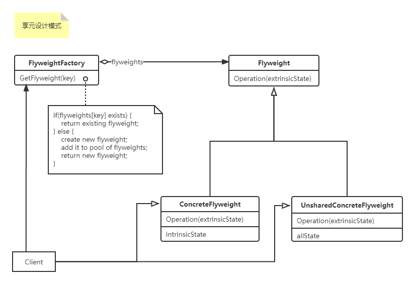
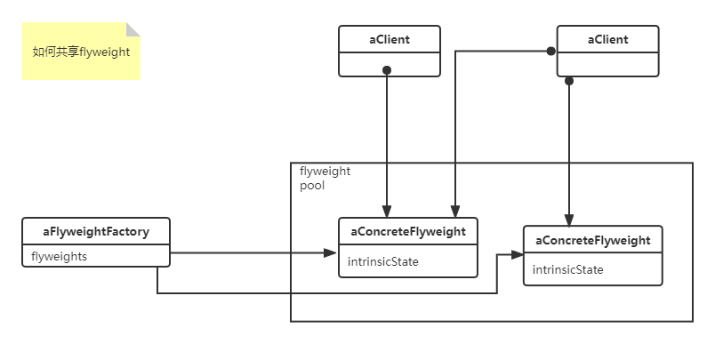

#### 享元设计模式（`Flyweight`）

> <font color=#FF6800>运用共享技术有效地支持大量细粒度的对象</font>
>
> 使用场景，以下情况都成立时使用Flyweight模式：
>
> - 一个应用程序使用了大量的对象
>
> - 完全由于使用大量的对象，造成很大的存储开销
>
> - 对象的大多数状态都可变为外部状态
>
> - 如果删除对象的外部状态，那么可以用相对较少的共享对象取代很多组对象
>
> - 应用程序不依赖于对象表示。由于Flyweight对象可以被共享，对于概念上明显有别的对象，标识测试将返回真值
>
> 内部状态：在享元对象的内部并且不会随着环境变化而产生变化的共享部分
> 外部状态：随环境变化而变化，不能共享的部分

1. 上ULM图：



如何共享flyweight示意图：



2. 上代码：

```c#
using System;
using System.Collections.Generic;

namespace DesignerPattern
{
    public class Client
    {
        public static void TestFlyweight_()
        {
            var factory = new FlyweightFactory();
            var flyweight1 = factory.CreateFlyweight("fuck1");
            var flyweight2 = factory.CreateFlyweight("fuck2");
            flyweight1.Operation($"{flyweight1.UniKey} -> extrinsicState1: what the fuck!");
            flyweight2.Operation($"{flyweight2.UniKey} -> extrinsicState2: what the fuck!");


        }
    }

    public abstract class Flyweight
    {
        public abstract string UniKey { get; set; }
        public abstract void Operation(string extrinsicState);
    }

    public class ConcreteFlyweight : Flyweight
    {
        private string _uniKey { get; set; }
        public override string UniKey
        {
            get { return _uniKey; }
            set { _uniKey = value; }
        }
        public override void Operation(string extrinsicState)
        {
            /// TODO 
            Console.WriteLine(extrinsicState);
        }
    }

    public class FlyweightFactory
    {
        private Dictionary<string, Flyweight> _pool = new Dictionary<string, Flyweight>();
        public Flyweight CreateFlyweight(string key)
        {
            if (!_pool.ContainsKey(key))
            {
                Flyweight flyweight = new ConcreteFlyweight();
                flyweight.UniKey = key;
                _pool.Add(key, flyweight);
            }
            return _pool[key];
        }
    }
}
```

