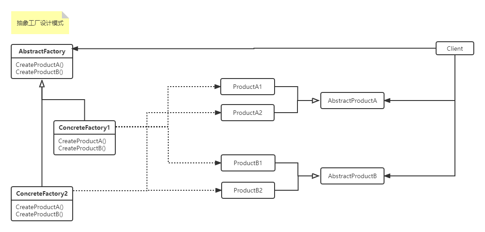

#### 抽象工厂设计模式

>提供一个创建Product的接口来负责创建相关或相互依赖的对象，而不用明确指定具体的类
>
>使用场景：
>
>- 一个系统要独立于它的产品的创建、组合和展示时
>- 一个系统要由多个产品系列中的一个来配置时
>- 当你要强调一系列相关的产品对象的设计以便进行联合使用时
>- 当你提供一个产品类库，只想显示它的接口而不是实现时
>
>优缺点：
>
>- 分离了具体的类
>- *使得易于交换产品系列*
>- *有利于产品的一致性*
>- 难以支持新种类产品，支持新种类产品就需要修改AbstractFactory接口，工厂的耦合程度比较高
>
>实现：
>
>- *用Factory Method实现*
>- *用Prototype实现*
>- *定义可扩展的Abstract Factory，参数化*
>- **使用模板以避免创建子类**

1. UML类图如下： 



2. 上代码

```c#
using System;

namespace DesignerPattern
{
    /// <summary>
    /// 抽象工厂设计模式
    /// </summary>
    public class AbstractFactoryPattern
    {
        public static void TestAbstractFactoryPattern_Test()
        {
            var abstractFactory = new ConcreteStandardFactory<ConcreteProductA, ConcreteProductB>();
            abstractFactory.CreateProductA().ProductA();
            abstractFactory.CreateProductB().ProductB();
        }
    }

    public abstract class AbstractProductA { public abstract void ProductA(); }
    public abstract class AbstractProductB { public abstract void ProductB(); }
    public abstract class AbstractFactory
    {
        public abstract AbstractProductA CreateProductA();
        public abstract AbstractProductB CreateProductB();
    }

    public class ConcreteStandardFactory<T,V> : AbstractFactory where T : AbstractProductA,new() where V : AbstractProductB ,new()
    {
        public override T CreateProductA()
        {
            return new T();
        }

        public override V CreateProductB()
        {
            return new V();
        }
    }

    public class ConcreteProductA : AbstractProductA
    {
        public override void ProductA()
        {
            Console.WriteLine("I am ConcreteProductA!");
        }
    }
    public class ConcreteProductB : AbstractProductB
    {
        public override void ProductB()
        {
            Console.WriteLine("I am ConcreteProductB!");
        }
    }
}
```

