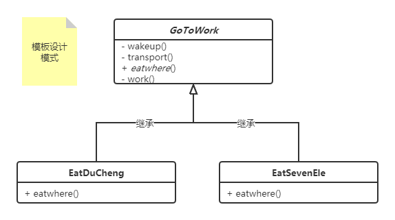

#### 模板设计模式

> <font color=#FF6800>模板设计模式的精髓在于把相同的部分抽象出来到抽象类中去定义，具体的子类来实现具体的不同部分</font>

1. UML图如下：


```c#
class client 
{
     static void Main(string[] args)
     {
          // 创建模板并调用
          var ducheng = new EatDucheng();
          ducheng.WorkThrough();
          Console.ReadLine();
     }
}
// 去工作
public abstract class GotoWork
{
     public void WorkThrough()
     {
          Console.WriteLine("每天醒来，又是社畜的一天~");
          this.WakeUp();
          this.Transport();
          this.EatWhere();
          this.Working();
     }
     public void WakeUp()
     {
          Console.WriteLine("睁开眼醒来~");
     }
     public void Transport()
     {
          Console.WriteLine("坐地铁到公司~");
     }
     // 留一个抽象方法给子类继承实现
     public abstract void EatWhere();
     public void Working()
     {
          Console.WriteLine("又是摸鱼的一天~");
     }
}
public class EatDucheng : GotoWork
{
     public override void EatWhere()
     {
          Console.WriteLine("吃都城~");
     }
}
public class EatSevenEle : GotoWork
{
     public override void EatWhere()
     {
          Console.WriteLine("吃七仔~");
     }
}
```

