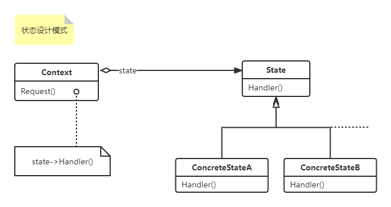

#### 状态设计模式（`State`）

> <font color=#FF6800>允许一个对象在其内部状态改变时改变它的行为。对象看起来似乎修改了它的类。状态模式将每种状态对应的行为抽象成单独的对象</font>
>
> 角色：
>
> - Context，上下文，定义客户感兴趣的接口，会维护一个State实例，这个实例会定义当前状态
> - State，状态，定义一个接口以封装与Context的一个特定状态相关的行为
> - ConcreteState，状态子类，每个子类都实现了一个与Context中一个状态相关的行为
>
> 使用场景：
>
> - 一个对象的行为取决于它的状态，并且它需要再运行时刻根据状态改变它的行为
> - 一个操作中有大量分支语句，并且这些分支依赖于对该对象的状态。这个状态通常使用一个或多个枚举常量表示。State模式将每一个条件分支放到了一个独立的类中，这可以让你根据对象自身的情况将对象的状态作为一个对象，这一个对象可以不依赖与其他对象而独立变化
>
> 缺点：
> - 该模式将不同状态的行为分布在多个State子类中，这会增加子类的数量，相对于单个类的实现来说不够紧凑
> 
> 现实场景：
> - TCPConnection
> - 交互式绘图程序的”工具“，

1. UML类图如下：



2. 上代码：
```c#
using System;

namespace DesignerPattern
{
    public class StatePattern
    {
        public static void TestState_ContextState()
        {
            var context = new Context(new ConcreteStateA());
            context.Request();
            context.Request();
            context.SetSate(new ConcreteStateB());
            context.Request();
            context.Request();

            /*
                State A handling
                State B handling
                State B handling
                State A handling
             */
        }

        
    }

    public class Context
    {
        private State _state;
        public Context(State state)
        {
            _state = state;
        }
        public void SetSate(State state)
        {
            _state = state;
        }
        public void Request()
        {
            _state.Handler(this);
        }
    }

    public abstract class State
    {
        public abstract void Handler(Context context);
    }

    public class ConcreteStateA : State
    {
        public override void Handler(Context context)
        {
            context.SetSate(new ConcreteStateB());
            Console.WriteLine("State A handling");
        }
    }

    public class ConcreteStateB : State
    {
        public override void Handler(Context context)
        {
            context.SetSate(new ConcreteStateA());
            Console.WriteLine("State B handling");
        }
    }
}
```