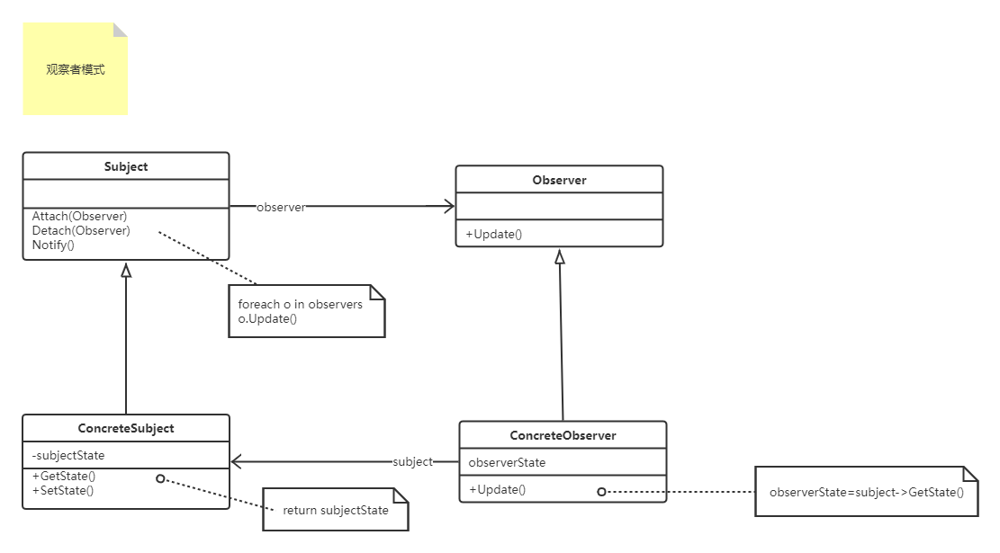

#### 观察者设计模式（`Observer`）

> <font color=#FF6800>观察者模式，定义对象间的一种一对多的依赖关系，当主题对象的状态发生改变时，所有依赖于它的观察者对象都得到通知并更新</font>
>
> 在观察者模式中有以下角色：
>
> - 抽象主题（ISubject）：抽象主题把所有观察者对象的引用保存在列表中，并提供观察者对象的增加删除接口
> - 抽象观察者（IObserver）: 为所有具体观察者定义一个接口，在得到主题通知时更新自己
> - 具体主题（ConcreteSubject）：实现抽象主题接口，在主题状态发生改变时实现对所有已注册的IObserver发送通知
> - 具体观察者（ConcreteObserver）：定义观察者的基础信息，并维护一个指向ISubject对象的引用，在接收到ConcreteSubject发出的通知时做出对应操作
>
> 优缺点：
>
> - 目标和观察者之间的抽象耦合，目标仅知+道自己有一系列观察者，每个都符合抽象的Observer类简单接口，但并不知道任意一个观察者属于哪一个具体类。
> - 支持广播通信，目标发送通知不需要制定接收者，通知会自动广播给所有向该目标登记了的观察者，目标也不需要关系有多少观察者对自己感兴趣
> - 目标的更新有些可能看似无害，但是却可能会对观察者造成错误的更新，如果观察者依赖准则的定义或维护不当，常常会引起错误的更新，这些错误通常难以捕捉
> 
> 实现：
> - 观察多个目标，一个观察者依赖于多个目标，例如：一个表格依赖于多个数据源，这样就需要扩展Update接口以使观察者知道是哪个目标的通知。把目标对象作为Update的一个参数，让观察者知道是哪个目标
> - 谁去触发更新，目标触发：优点是观察者不需要记住要在目标对象上调用Notify，缺点是多个连续操作会导致连续更新，效率比较低；观察者触发：优点是观察者可以在一系列状态完成后再触发更新，缺点是给观察者增加了触发更新的责任。
> 显式地指定感兴趣的改变（订阅事件），你可以扩展目标的注册接口，让观察者注册仅对特定事件感兴趣，让目标只通知注册了对该事件感兴趣的观察者，在Subject端，Attach(IObserver,Aspect&Interest)；在Observer端，Update(ISubject,Aspect&Interest)
> - 封装出一个更改管理器（ChangeManager）==Mediator，当目标和观察者之间的依赖关系特别复杂的时候，需要一个维护这些关系的对象，例如：一个操作涉及到对几个相互依赖的目标进行改动，就必须在所有的目标都更改完后再一次性通知观察者。

1. UML类图如下
  
2. 上代码
```c#
using System;
using System.Collections.Generic;
using System.ComponentModel;
using System.Reflection;

namespace DesignerPattern
{
    public class ObserverPattern
    {
        public static void TestObserver_TheVedio()
        {
            ISubject subject = new VedioService();
            subject.Vedios.Add(new Vedio(VedioType.Carton, 5, "鬼灭之刃"));
            subject.Vedios.Add(new Vedio(VedioType.Pn, 10, "神秘海域"));
            subject.AddObserver(new ConcreteObserver("小野狼"));
            subject.AddObserver(new ConcreteObserver("花花"));
            subject.AddObserver(new ConcreteObserver("小野猫"));
            subject.NotifyObservers();
            Console.ReadLine();
        }
    }

    public interface IObserver
    {
        string Name { get; set; }

        void ReceiveAndShowMsg(ISubject subject);
    }

    public class ConcreteObserver : IObserver
    {
        public string Name { get; set; }
        public ConcreteObserver(string _name)
        {
            Name = _name;
        }

        public void ReceiveAndShowMsg(ISubject subject)
        {
            subject.Vedios.ForEach(item =>
            {
                Console.WriteLine($"尊敬的{Name},您订阅的{item.VedioType.GetDescription()}类型片{item.Description}已更新，价格为{item.Price}￥，请及时观看！");
            });
        }
    }

    public interface ISubject
    {
        void AddObserver(IObserver o);
        void RemoveObserver(IObserver o);
        void NotifyObservers();
        List<Vedio> Vedios { get; set; }
    }

    public class VedioService : ISubject
    {
        private IList<IObserver> _observers;

        public List<Vedio> Vedios { get; set ; }

        public VedioService()
        {
            _observers = new List<IObserver>();
            Vedios = new List<Vedio>();
        }

        public void AddObserver(IObserver o)
        {
            _observers.Add(o);
        }

        public void RemoveObserver(IObserver o)
        {
             _observers.Remove(o);
        }

        public void NotifyObservers()
        {
            foreach(var item in _observers)
            {
                item.ReceiveAndShowMsg(this);
            }
        }
    }

    public class Vedio
    {
        public Vedio(VedioType _type,decimal _price,string _desc)
        {
            VedioType = _type;
            Price = _price;
            Description = _desc;
        }
        public VedioType VedioType { get; set; }
        public decimal Price { get; set; }
        public string Description { get; set; }
    }

    public enum VedioType
    {
        [Description("xxx")]
        Pn,
        [Description("卡通")]
        Carton,
        [Description("学习")]
        Class,
        [Description("搞笑")]
        Funny
    }

    public static class EnumExtension
    {
        public static string GetDescription<T>(this T obj) where T : Enum
        {
            Type type = obj.GetType();
            FieldInfo field = type.GetField(Enum.GetName(type, obj));
            DescriptionAttribute desc = Attribute.GetCustomAttribute
            (field, typeof(DescriptionAttribute)) as DescriptionAttribute;
            if (desc == null)
            {
                return string.Empty;
            }

            return desc.Description;
        }
    }
}

```